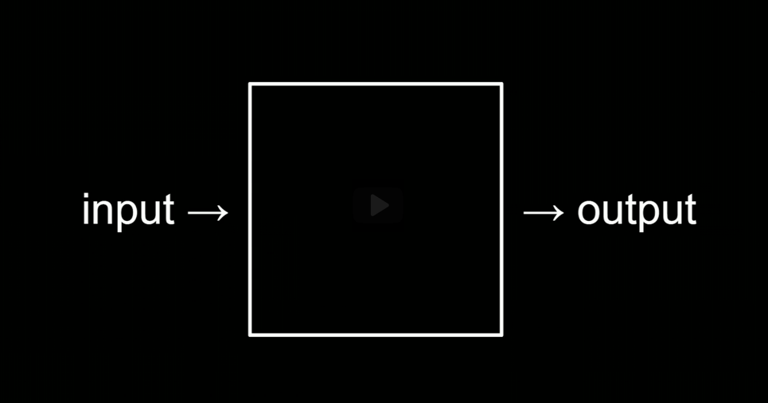

# lecture 0

the thing within the black box is an algorithm

an algorithm is a set way to do something 
a step by step set of instruction to solve a certain problem 

divide and conquer algorithm:
- 1024
- 512
- 256
- 128
- 64
- 32
- 16
- 8
- 4
- 2
- 1
 
essentially, go to the middle of a data set lok to which way yhe requested data is and throw/ do not use the other half. 

<b>Psuedo code</b> 
A set of instructions which a certain process has to perform to complete a task 
Tip: make this as detailed a possible because a computer only does what you tell it to do and nothing more. 

1. pick up phonebook
2. open to middle of phone book
3. look at page
4. if smith is on page
    5. call mike
6. Else if smith is earlier in book
    7. open to middle of left half of book
    8. Go back to line 3
9. Else if Smith is later in book
    10. open to middle of right half of book
    11. go back to line 3
12. else
    13. quit

programming constructs
- Functions
- conditions
- Boolean expressions
- Loops
- Variables
- threads
- events
- ....

