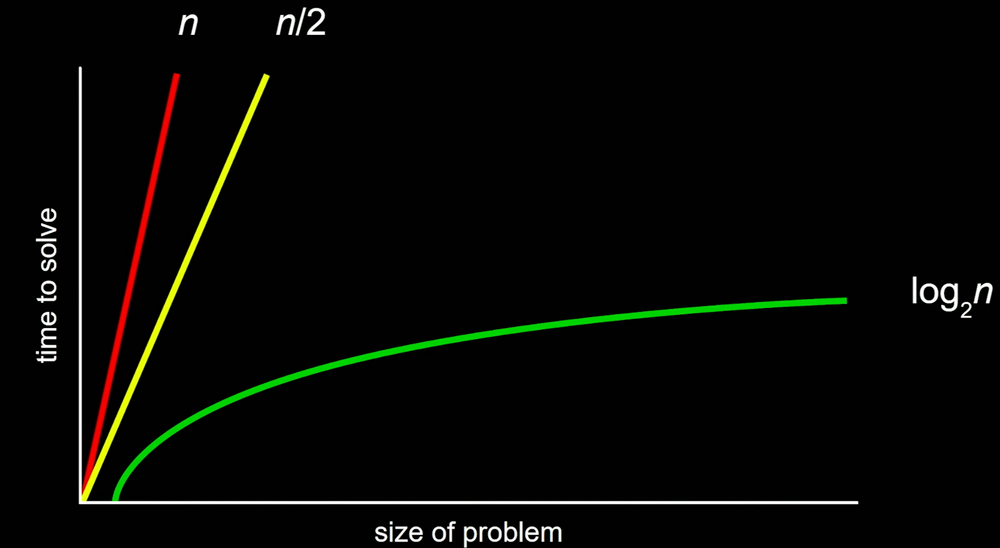

# Notes Lecture 3 CS50: Algorithms

<b>Types of algorithms</b>

- linear search
- Binary search (divide and conquer)
- bubble sort
- selection sort
- merge sort

### Linear search

```
    for i from 0 to n-1
        if i'th element is 50
            return true
    return false
```

### binary search

```
    if no items
        return false
    if middle item is 50
        return true
    else if 50 < middle item
        search left half
    else if 50 > middle item
        search right half

```
## algorithm comparison



big o notation = on the order of<br>
= efficiency of the algorithm<br>
O(N) O(N/2) O(log2N)<br>

## The bigger the problem the more binary and linear search become similar


<b>Common run times</b>

- O(n2) bubble sort, selection sort
- O(n log n) merge sort
- O(n) = linear search
- O(log n) = binary search
- O(1)

omega = oppisite of big O<br>
= best cases<br>
Big O = upper bound <br>
omega = lower bound <br.>

- Ω(n2) bubble sort
- Ω(n log n) merge sort
- Ω(n) selection sort
- Ω(log n)
- Ω(1)      Linear search, binary search

## Bubble sort

```
    Repeat until no swap
        for i from 0 to n-2
            If i'th and i + 1'th elements out of order
                swap them
            If i'th and i + 1'th elements in order
                leave them
```

O(n2) fo bubble sort 
omega(n) for bubble sort

reason to quit is when making a pass and there not being any work

## Selection sort

Look for the smallest number in a list <br>
swap it with the nth smallest item in the list<br>
in each round find the next smallest item.<br>

```

    for i from 0 to n-1
        find the smallest item between ith item and last item
        swap smallest item with i'th item

```
O(n2) for selection sort
omega(n2) for selection sort

## Recursion

interation = to loop over something again and again
implementing code/ an algorithm which keeps calling itself
hand it an input which is smaller than the original input

## Merge sort

```
    If only one item
        Return
    Else
        Sort left half of items
        Sort right half of items
        Merge sorted halves
```